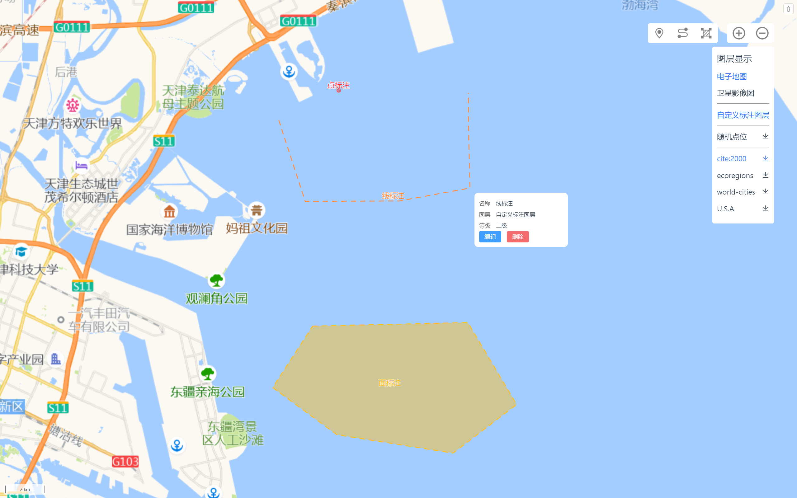
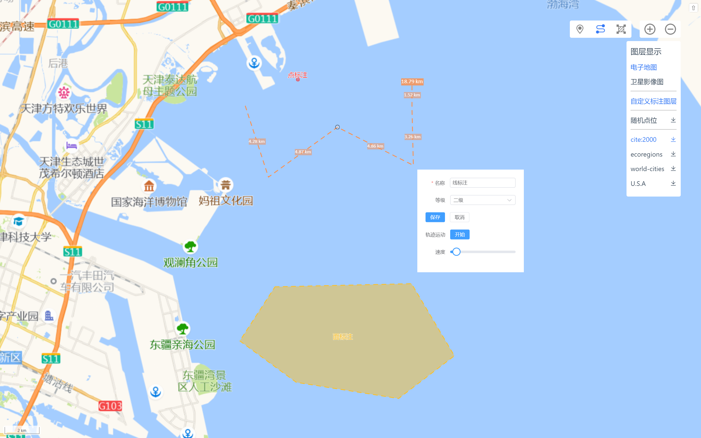

# openlayers10-vue3-ts

在 Vue 3 应用程序中使用 Vite 工具链和 OpenLayers10 创建一个简单的地图实例，并实现一些基础的地图交互功能。

[Demo](https://liuzhenghe30265.github.io/openlayers10-vue3-ts/)

## 地图初始化

## 底图加载与切换

## GeoJSON 数据的加载与导出

## 绘制功能

## 轨迹回放功能

使用 VectorLayer postrender 实现丝滑的轨迹运动效果。
